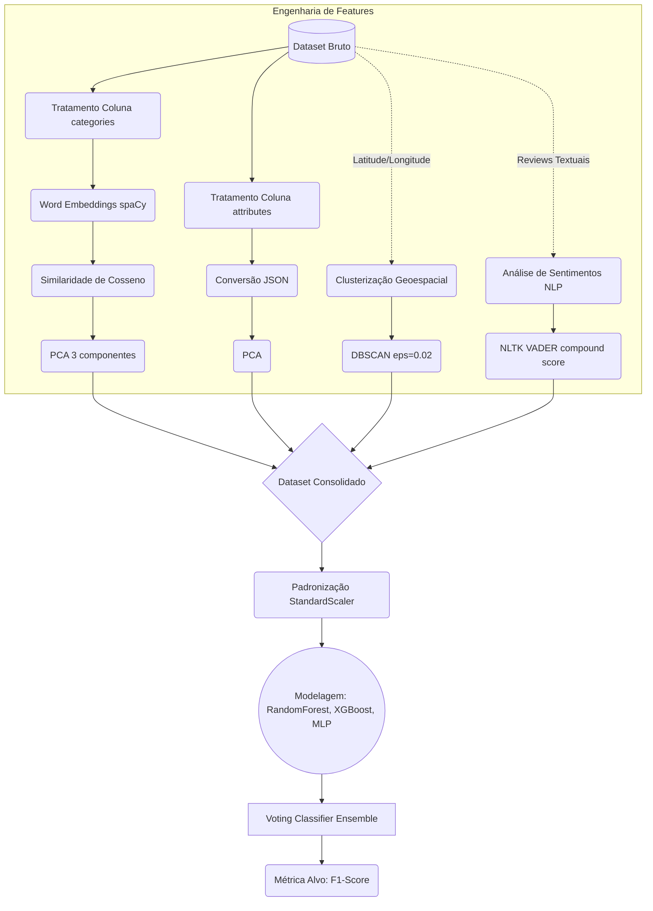

# Predict Rated Venues

O objetivo do projeto é prever se estabelecimentos em Toronto, ON, Canadá, receberão altas avaliações (1) ou não (0). Usamos o **F1-Score médio** como métrica alvo.

## Pipeline de Dados

O diagrama abaixo ilustra o fluxo desde o dataset bruto até as previsões:



## Técnicas de Machine Learning Aplicadas

Para construir as features e os modelos, utilizamos:

* **Word Embeddings e Similaridade Semântica**: A coluna `categories` foi transformada utilizando vetores pré-treinados do `spaCy`. Calculamos a similaridade de cosseno para capturar as relações semânticas das categorias e reduzimos a dimensionalidade com **PCA (3 componentes)**.
* **Processamento de Atributos**: Os dados de `attributes`, inicialmente em JSON, foram normalizados. Aplicamos PCA para extrair as variáveis mais relevantes.
* **Clusterização Geoespacial**: As coordenadas de latitude e longitude dos locais alimentaram o algoritmo **DBSCAN** (`eps=0.02`). Isso permitiu criar clusters identificando concentrações espaciais e zonas de interesse em Toronto.
* **Análise de Sentimentos (NLP)**: O texto das reviews de cada estabelecimento foi processado usando o **NLTK VADER**, extraindo o *compound score*. Isso gera uma feature que reflete o sentimento geral das reviews.
* **Modelagem Ensemble**: Todas as features consolidadas passaram por padronização com `StandardScaler`. O preditor final é um **Voting Classifier** que combina três modelos:
  * **RandomForest** 
  * **XGBoost** 
  * **MLP (Multi-Layer Perceptron)** 

## Reprodução do Ambiente

O ambiente de execução e as dependências são gerenciados pelo `uv`. 

Para iniciar o Jupyter com o ambiente virtual correto, rode:

```bash
uv run jupyter notebook
```

O fluxo de execução é dividido em dois Jupyter Notebooks principais:
1. `01_preparacao_treinamento_modelos.ipynb`: Faz o tratamento dos dados de treino, engenharia de features e treinamento do ensemble.
2. `02_preparacao_teste.ipynb`: Aplica a mesma pipeline nos dados de teste para gerar o baseline e as previsões da métrica F1-Score.
