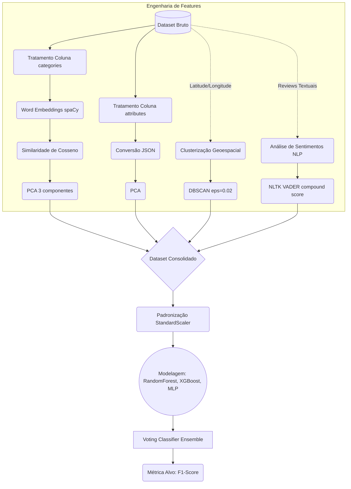

# Predict Rated Venues

O objetivo do projeto é prever se estabelecimentos em Toronto, ON, Canadá, receberão altas avaliações (1) ou não (0). É utilizado o **F1-Score médio** como métrica alvo.

## Pipeline de Dados

O diagrama abaixo ilustra o fluxo desde o dataset bruto até as previsões:



## Técnicas de Machine Learning Aplicadas

Para a construção das features e dos modelos, foram utilizadas as seguintes técnicas:

* **Word Embeddings e Similaridade Semântica**: A coluna `categories` foi transformada utilizando vetores pré-treinados do `spaCy`. Foi calculada a similaridade de cosseno para capturar as relações semânticas das categorias e a dimensionalidade foi reduzida com **PCA (3 componentes)**.
* **Processamento de Atributos**: Os dados de `attributes`, inicialmente em JSON, foram normalizados. Foi aplicado PCA para extrair as variáveis mais relevantes.
* **Clusterização Geoespacial**: As coordenadas de latitude e longitude dos locais alimentaram o algoritmo **DBSCAN** (`eps=0.02`). Isso permitiu a criação de clusters para identificar concentrações espaciais e zonas de interesse em Toronto.
* **Análise de Sentimentos (NLP)**: O texto das reviews de cada estabelecimento foi processado usando o **NLTK VADER**, extraindo o *compound score*. Foi gerada uma feature que reflete o sentimento geral das reviews.
* **Modelagem Ensemble**: Todas as features consolidadas passaram por padronização com `StandardScaler`. O preditor final consiste em um **Voting Classifier** que combina três modelos:
  * **RandomForest** 
  * **XGBoost** 
  * **MLP (Multi-Layer Perceptron)** 

## Reprodução do Ambiente

O ambiente de execução e as dependências são gerenciados pelo `uv`. 

Para iniciar o Jupyter com o ambiente virtual correto, execute:

```bash
uv run jupyter notebook
```

> [!NOTE]
> Os dados necessários para a execução do programa podem ser obtidos via [Google Drive](https://drive.google.com/drive/folders/1xpVQjH00xRgRQc56ggdAe0Avqz_027Go?usp=drive_link).

O fluxo de execução é dividido em dois Jupyter Notebooks principais:
1. `01_preparacao_treinamento_modelos.ipynb`: Realiza o tratamento dos dados de treino, engenharia de features e treinamento do ensemble.
2. `02_preparacao_teste.ipynb`: Aplica a mesma pipeline nos dados de teste para gerar o baseline e as previsões da métrica F1-Score.

## Contexto do Exercício Acadêmico (CDA UTFPR 2024)

Este projeto foi originalmente desenvolvido como um exercício prático no âmbito do curso de **Especialização em Ciência de Dados da Universidade Tecnológica Federal do Paraná (UTFPR)** no ano de 2024.

### Desafio: *Predict highly rated venues - CDA UTFPR 2024*
* **Período do Desafio:** 27 de Junho de 2024 a 26 de Agosto de 2024.
* **Fonte dos Dados:** Yelp (fornecidos para a competição acadêmica).

### Descrição do Problema
O objetivo do desafio consistiu em prever se um estabelecimento (*venue*) localizado na cidade de Toronto, ON, Canadá, seria considerado altamente avaliado (`destaque = 1`) ou não (`destaque = 0`), a partir do mapeamento livre e exploração dos dados disponibilizados.

### Métrica de Avaliação
A métrica oficial do desafio foi o **Mean F1-Score**. O F1-Score representa a média harmônica entre a Precisão (*Precision*, $p$) e a Revocação (*Recall*, $r$):

$$F1 = 2 \cdot \frac{p \cdot r}{p + r}$$

Onde:
* $p = \frac{tp}{tp + fp}$ (Precisão: razão de verdadeiros positivos sobre todas as predições positivas)
* $r = \frac{tp}{tp + fn}$ (Revocação: razão de verdadeiros positivos sobre o total real de positivos)

A métrica pondera igualmente a precisão e o recall, premiando soluções com desempenho equilibrado em ambas as dimensões.

### Estrutura do Dataset Original
* **Download dos Dados:** Os arquivos do dataset para execução podem ser baixados na pasta do [Google Drive](https://drive.google.com/drive/folders/1xpVQjH00xRgRQc56ggdAe0Avqz_027Go?usp=drive_link).
* **Arquivos do Projeto:**
  * `X_trainToronto.csv`: Dataset principal de treinamento.
  * `reviewsTrainToronto.csv`: Avaliações textuais complementares de treino.
  * `X_testToronto.csv`: Dataset de teste.
  * `reviewsTestToronto.csv`: Avaliações textuais complementares de teste.
  * `sampleResposta.csv`: Exemplo no formato esperado de submissão.

* **Campos dos Dados (`X_train.csv` / `X_test.csv`):**
  * `business_id`: Identificador único do estabelecimento (*venue*).
  * `name`: Nome do estabelecimento.
  * `address`: Endereço.
  * `postal_code`: Código postal.
  * `latitude` / `longitude`: Coordenadas geográficas.
  * `review_count`: Total de avaliações recebidas.
  * `is_open`: Indicador se o estabelecimento está aberto (1) ou fechado (0).
  * `attributes`: Atributos estruturados em formato JSON (ex: WiFi, ruído, traje).
  * `categories`: Categorias/ramos do estabelecimento.
  * `hours`: Horários de funcionamento.
  * `loc`: Detalhes adicionais de localização.
  * `destaque`: Variável alvo (*target*) a ser prevista no conjunto de teste (1 para altamente avaliado, 0 caso contrário).

* **Campos das Reviews (`reviewsTrainToronto.csv` / `reviewsTestToronto.csv`):**
  * `business_id`: Identificador do estabelecimento.
  * `user_id`: Identificador anônimo do usuário.
  * `useful`, `funny`, `cool`: Contagem de reações recebidas pela avaliação.
  * `text`: Texto da avaliação (*review*).
  * `date`: Data de publicação da avaliação.

### Formato de Submissão
O arquivo de resposta deve ser gerado no formato CSV contendo o cabeçalho e duas colunas (`business_id` e `destaque`):

```csv
business_id,destaque
uLHRvzarplBajOnekB8eiA,1
aUHJpzarplIIuHH7jHJjyH,1
hTTGbGttgcd35fGGFFVF23,0
```
